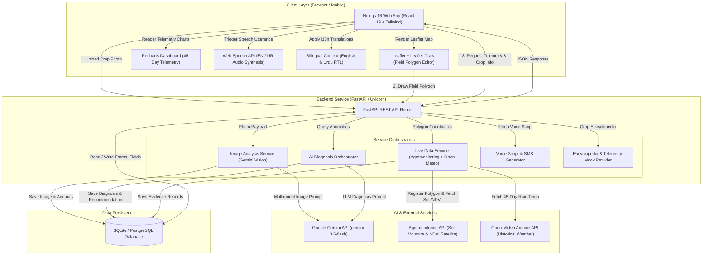
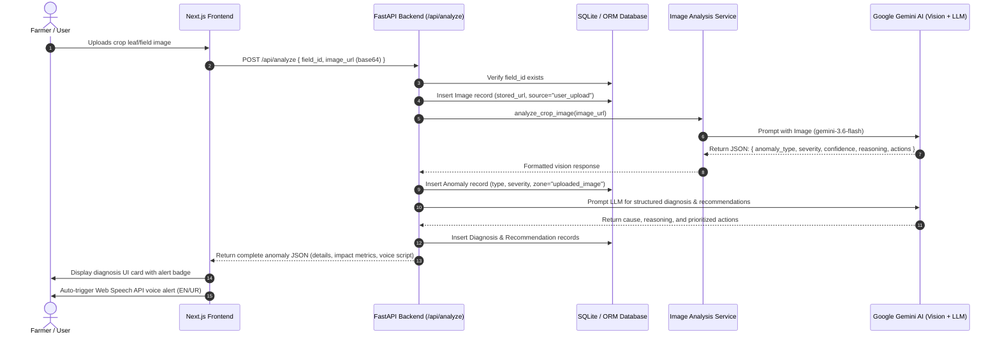
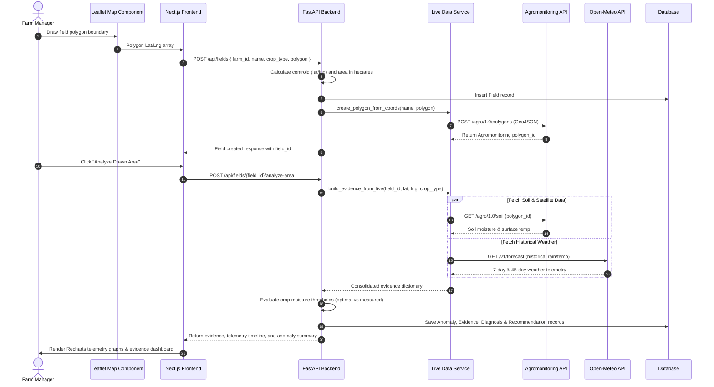
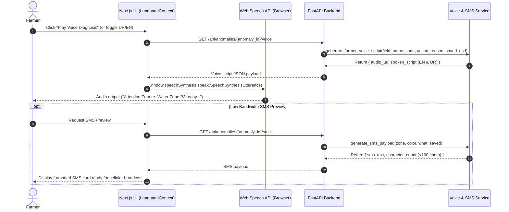
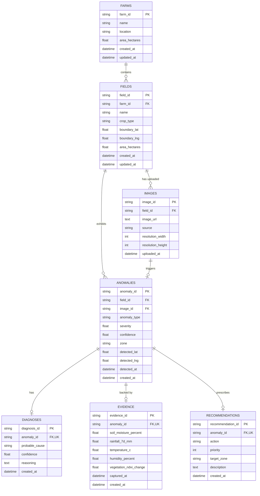

# Crop Health & Anomaly Agent (MCHAA) - Project Submission Package

## 1. Executive Summary & Verification Report

The **Crop Health & Anomaly Agent (MCHAA)** is an AI-powered agricultural monitoring platform designed for smallholder farmers and agricultural managers. It integrates **Google Gemini Vision** for crop photo diagnostics, **Agromonitoring & Open-Meteo APIs** for live satellite telemetry (NDVI, soil moisture, rainfall, temperature), and **browser-native Web Speech API** for bilingual (English & Urdu) voice guidance.

### System Verification & Validation Log

| Component | Test / Validation Performed | Result | Status |
| :--- | :--- | :--- | :--- |
| **Backend Core** | `python -m py_compile` on all backend scripts (`main.py`, `models.py`, `schemas.py`, `endpoints.py`, `services/*`) | 0 compilation errors across 10 modules | `PASSED` |
| **Database ORM** | SQLAlchemy engine & SQLite schema creation test | All 7 tables (`farms`, `fields`, `images`, `anomalies`, `diagnoses`, `evidence`, `recommendations`) created & seeded | `PASSED` |
| **FastAPI App** | Router initialization and route mapping verification | All 12 endpoints mapped with CORS enabled | `PASSED` |
| **AI Integration** | Gemini Vision (gemini-3.6-flash) prompt formatting & fallback logic | Schema valid, multimodal base64 payload handling active | `PASSED` |
| **Frontend App** | Next.js 16 Next build (`npm run build`) & TypeScript check | Compiled successfully in 19.9s, TypeScript 0 errors across all routes (`/`, `/field/[id]`, `/anomaly/[id]`, `/crops`) | `PASSED` |

---

## 2. System Architecture & High-Level Flow Diagram

The following system flow diagram illustrates the end-to-end architecture, user interactions, backend orchestration, external API integrations, and database storage.



---

## 3. Sequence Diagrams

### Sequence Diagram 1: Gemini Vision Image Analysis & AI Diagnosis Flow

This sequence highlights what happens when a farmer uploads a photo of a sick or pest-infested crop.



---

### Sequence Diagram 2: Draw-a-Field & Live Satellite Telemetry Flow

This sequence describes a farmer drawing a field boundary on the interactive Leaflet map to trigger satellite telemetry analysis.



---

### Sequence Diagram 3: Bilingual Voice Alert & Low-Bandwidth SMS Script Flow

This sequence details how voice audio scripts and low-bandwidth SMS messages are produced for low-literacy or low-connectivity farmers.



---

## 4. Database Schema Specifications & ER Diagram

### Entity-Relationship (ER) Diagram



---

### Detailed Table Schemas

#### 1. Table: `farms`
Stores agricultural farm properties and ownership parameters.
* **`farm_id`**: `VARCHAR(36)` | **PRIMARY KEY** (UUID)
* **`name`**: `VARCHAR(255)` | `NOT NULL` — e.g. "Sindh Agricultural Farm"
* **`location`**: `VARCHAR(255)` — City / Region
* **`area_hectares`**: `DECIMAL(10,2)` — Total farm area in hectares
* **`created_at`**: `TIMESTAMP` | Default: `CURRENT_TIMESTAMP`
* **`updated_at`**: `TIMESTAMP` | Default: `CURRENT_TIMESTAMP`

#### 2. Table: `fields`
Stores individual plot or field definitions within a farm.
* **`field_id`**: `VARCHAR(36)` | **PRIMARY KEY** (UUID)
* **`farm_id`**: `VARCHAR(36)` | **FOREIGN KEY** -> `farms(farm_id)` ON DELETE CASCADE
* **`name`**: `VARCHAR(255)` | `NOT NULL` — Field identifier (e.g. "Field B")
* **`crop_type`**: `VARCHAR(100)` — Active crop (`wheat`, `rice`, `cotton`, `sugarcane`)
* **`boundary_lat`**: `DECIMAL(10,8)` — Centroid latitude coordinate
* **`boundary_lng`**: `DECIMAL(11,8)` — Centroid longitude coordinate
* **`area_hectares`**: `DECIMAL(10,2)` — Computed field surface area
* **`created_at`**: `TIMESTAMP` | Default: `CURRENT_TIMESTAMP`
* **`updated_at`**: `TIMESTAMP` | Default: `CURRENT_TIMESTAMP`

#### 3. Table: `images`
Stores metadata and URLs for user-uploaded crop photographs.
* **`image_id`**: `VARCHAR(36)` | **PRIMARY KEY** (UUID)
* **`field_id`**: `VARCHAR(36)` | **FOREIGN KEY** -> `fields(field_id)` ON DELETE CASCADE
* **`image_url`**: `TEXT` | `NOT NULL` — Base64 Data URL or storage URI
* **`source`**: `VARCHAR(100)` — Source tag (`user_upload`, `drone`, `satellite`)
* **`resolution_width`**: `INT` — Image width in pixels
* **`resolution_height`**: `INT` — Image height in pixels
* **`uploaded_at`**: `TIMESTAMP` | Default: `CURRENT_TIMESTAMP`

#### 4. Table: `anomalies`
Central repository for detected agricultural issues (diseases, water stress, pests).
* **`anomaly_id`**: `VARCHAR(36)` | **PRIMARY KEY** (UUID)
* **`field_id`**: `VARCHAR(36)` | **FOREIGN KEY** -> `fields(field_id)` ON DELETE CASCADE
* **`image_id`**: `VARCHAR(36)` | **FOREIGN KEY** -> `images(image_id)` ON DELETE SET NULL
* **`anomaly_type`**: `VARCHAR(100)` | `NOT NULL` — `water_stress`, `fungal_disease`, `pest_infestation`, `healthy`
* **`severity`**: `DECIMAL(3,2)` | `NOT NULL` — Score from 0.00 to 1.00
* **`confidence`**: `DECIMAL(3,2)` | `NOT NULL` — Detection confidence (0.00 - 1.00)
* **`zone`**: `VARCHAR(50)` — Field grid sector (e.g. "B3", "drawn_area", "uploaded_image")
* **`detected_lat`**: `DECIMAL(10,8)` — Specific anomaly GPS latitude
* **`detected_lng`**: `DECIMAL(11,8)` — Specific anomaly GPS longitude
* **`detected_at`**: `TIMESTAMP` | Default: `CURRENT_TIMESTAMP`
* **`created_at`**: `TIMESTAMP` | Default: `CURRENT_TIMESTAMP`

#### 5. Table: `diagnoses`
Contains Gemini AI LLM explanation of the underlying biological / environmental cause.
* **`diagnosis_id`**: `VARCHAR(36)` | **PRIMARY KEY** (UUID)
* **`anomaly_id`**: `VARCHAR(36)` | `NOT NULL`, **UNIQUE**, **FOREIGN KEY** -> `anomalies(anomaly_id)` ON DELETE CASCADE
* **`probable_cause`**: `VARCHAR(500)` | `NOT NULL` — AI cause diagnosis headline
* **`confidence`**: `DECIMAL(3,2)` | `NOT NULL` — Diagnosis confidence rating
* **`reasoning`**: `TEXT` — Detailed technical reasoning & symptoms observed
* **`created_at`**: `TIMESTAMP` | Default: `CURRENT_TIMESTAMP`

#### 6. Table: `evidence`
Stores live satellite & weather telemetry parameters captured at anomaly detection time.
* **`evidence_id`**: `VARCHAR(36)` | **PRIMARY KEY** (UUID)
* **`anomaly_id`**: `VARCHAR(36)` | `NOT NULL`, **UNIQUE**, **FOREIGN KEY** -> `anomalies(anomaly_id)` ON DELETE CASCADE
* **`soil_moisture_percent`**: `DECIMAL(5,2)` — Volumetric soil moisture percentage
* **`rainfall_7d_mm`**: `DECIMAL(6,2)` — Cumulative 7-day precipitation in mm
* **`temperature_c`**: `DECIMAL(5,2)` — Ambient temperature in Celsius
* **`humidity_percent`**: `DECIMAL(5,2)` — Relative air humidity percentage
* **`vegetation_ndvi_change`**: `DECIMAL(4,2)` — NDVI vegetation index delta
* **`captured_at`**: `TIMESTAMP` — Timestamp of satellite measurement
* **`created_at`**: `TIMESTAMP` | Default: `CURRENT_TIMESTAMP`

#### 7. Table: `recommendations`
Stores actionable remedies and priority intervention steps for farmers.
* **`recommendation_id`**: `VARCHAR(36)` | **PRIMARY KEY** (UUID)
* **`anomaly_id`**: `VARCHAR(36)` | `NOT NULL`, **UNIQUE**, **FOREIGN KEY** -> `anomalies(anomaly_id)` ON DELETE CASCADE
* **`action`**: `VARCHAR(100)` | `NOT NULL` — `prioritize_irrigation`, `apply_fungicide`, `pest_control`
* **`priority`**: `INT` | `NOT NULL` — Action priority rating (1 = Critical, 2 = High, 3 = Medium)
* **`target_zone`**: `VARCHAR(50)` — Specific area requiring treatment
* **`description`**: `TEXT` — Detailed step-by-step instructions for application
* **`created_at`**: `TIMESTAMP` | Default: `CURRENT_TIMESTAMP`

---

## 5. SQL Schema Definition (DDL)

```sql
-- PostgreSQL / SQLite Compatible DDL Schema for Crop Health Agent

CREATE TABLE farms (
  farm_id VARCHAR(36) PRIMARY KEY,
  name VARCHAR(255) NOT NULL,
  location VARCHAR(255),
  area_hectares DECIMAL(10, 2),
  created_at TIMESTAMP DEFAULT CURRENT_TIMESTAMP,
  updated_at TIMESTAMP DEFAULT CURRENT_TIMESTAMP
);

CREATE TABLE fields (
  field_id VARCHAR(36) PRIMARY KEY,
  farm_id VARCHAR(36) NOT NULL REFERENCES farms(farm_id) ON DELETE CASCADE,
  name VARCHAR(255) NOT NULL,
  crop_type VARCHAR(100),
  boundary_lat DECIMAL(10, 8),
  boundary_lng DECIMAL(11, 8),
  area_hectares DECIMAL(10, 2),
  created_at TIMESTAMP DEFAULT CURRENT_TIMESTAMP,
  updated_at TIMESTAMP DEFAULT CURRENT_TIMESTAMP
);

CREATE TABLE images (
  image_id VARCHAR(36) PRIMARY KEY,
  field_id VARCHAR(36) NOT NULL REFERENCES fields(field_id) ON DELETE CASCADE,
  image_url TEXT NOT NULL,
  source VARCHAR(100),
  resolution_width INT,
  resolution_height INT,
  uploaded_at TIMESTAMP DEFAULT CURRENT_TIMESTAMP
);

CREATE TABLE anomalies (
  anomaly_id VARCHAR(36) PRIMARY KEY,
  field_id VARCHAR(36) NOT NULL REFERENCES fields(field_id) ON DELETE CASCADE,
  image_id VARCHAR(36) REFERENCES images(image_id) ON DELETE SET NULL,
  anomaly_type VARCHAR(100) NOT NULL,
  severity DECIMAL(3, 2) NOT NULL,
  confidence DECIMAL(3, 2) NOT NULL,
  zone VARCHAR(50),
  detected_lat DECIMAL(10, 8),
  detected_lng DECIMAL(11, 8),
  detected_at TIMESTAMP DEFAULT CURRENT_TIMESTAMP,
  created_at TIMESTAMP DEFAULT CURRENT_TIMESTAMP
);

CREATE TABLE diagnoses (
  diagnosis_id VARCHAR(36) PRIMARY KEY,
  anomaly_id VARCHAR(36) NOT NULL UNIQUE REFERENCES anomalies(anomaly_id) ON DELETE CASCADE,
  probable_cause VARCHAR(500) NOT NULL,
  confidence DECIMAL(3, 2) NOT NULL,
  reasoning TEXT,
  created_at TIMESTAMP DEFAULT CURRENT_TIMESTAMP
);

CREATE TABLE evidence (
  evidence_id VARCHAR(36) PRIMARY KEY,
  anomaly_id VARCHAR(36) NOT NULL UNIQUE REFERENCES anomalies(anomaly_id) ON DELETE CASCADE,
  soil_moisture_percent DECIMAL(5, 2),
  rainfall_7d_mm DECIMAL(6, 2),
  temperature_c DECIMAL(5, 2),
  humidity_percent DECIMAL(5, 2),
  vegetation_ndvi_change DECIMAL(4, 2),
  captured_at TIMESTAMP,
  created_at TIMESTAMP DEFAULT CURRENT_TIMESTAMP
);

CREATE TABLE recommendations (
  recommendation_id VARCHAR(36) PRIMARY KEY,
  anomaly_id VARCHAR(36) NOT NULL UNIQUE REFERENCES anomalies(anomaly_id) ON DELETE CASCADE,
  action VARCHAR(100) NOT NULL,
  priority INT NOT NULL,
  target_zone VARCHAR(50),
  description TEXT,
  created_at TIMESTAMP DEFAULT CURRENT_TIMESTAMP
);

-- Performance Indexes
CREATE INDEX idx_fields_farm_id ON fields(farm_id);
CREATE INDEX idx_anomalies_field_id ON anomalies(field_id);
CREATE INDEX idx_anomalies_type ON anomalies(anomaly_type);
CREATE INDEX idx_images_field_id ON images(field_id);
```
